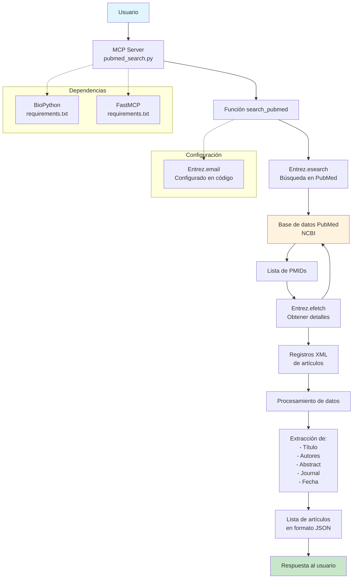

# PubMed-MCP

A Model Context Protocol (MCP) server that provides tools for searching PubMed articles using the NCBI Entrez API.

**Author:** Emilio Delgado Muñoz

## Features

- Search PubMed for articles based on queries
- Retrieve detailed information including title, authors, abstract, journal, and publication date
- Returns results in JSON format
- Configurable maximum number of results

## Architecture



## Installation

1. Clone this repository:
   ```bash
   git clone <repository-url>
   cd PubMed-MCP
   ```

2. Install dependencies:
   ```bash
   uv sync
   ```

3. Configure your email in `pubmed_search.py`:
   ```python
   Entrez.email = 'your-email@example.com'  # Replace with your actual email
   ```

## VS Code Configuration

To use this MCP server locally in VS Code, the project includes a pre-configured `.vscode/mcp.json` file. This file tells VS Code how to run the MCP server.

The configuration is already set up to use `uv` for running the server:

```json
{
  "servers": {
    "pubmed-mcp": {
      "command": "uv",
      "args": ["run", "${workspaceFolder}/pubmed_search.py"]
    }
  }
}
```

### Requirements for VS Code Integration

- VS Code with MCP extension support
- `uv` package manager installed
- Python virtual environment set up

### Alternative Configuration

If you prefer to use `pip` instead of `uv`, you can modify the `.vscode/mcp.json` file:

```json
{
  "servers": {
    "pubmed-mcp": {
      "command": "python",
      "args": ["${workspaceFolder}/pubmed_search.py"]
    }
  }
}
```

Make sure your virtual environment is activated when using this configuration.

## Requirements

- Python 3.11+
- BioPython
- FastMCP

## Usage

Run the MCP server:

```bash
python pubmed_search.py
```

The server will start and listen for MCP protocol messages on stdin/stdout.

## Available Tools

### search_pubmed

Searches PubMed for articles matching the given query.

**Parameters:**
- `query` (string): The search query
- `max_results` (integer, optional): Maximum number of results to return (default: 10)

**Returns:**
A list of article objects containing:
- `pmid`: PubMed ID
- `title`: Article title
- `authors`: List of author names
- `abstract`: Article abstract
- `journal`: Journal name
- `publication_year`: Year of publication
- `publication_month`: Month of publication
- `url`: PubMed URL

## Configuration

Before using the tool, you must set your email address in the `Entrez.email` variable. This is required by NCBI's Entrez API.

## License

This project is open source. Please check the license file for details.

## Contributing

Contributions are welcome! Please feel free to submit a Pull Request.